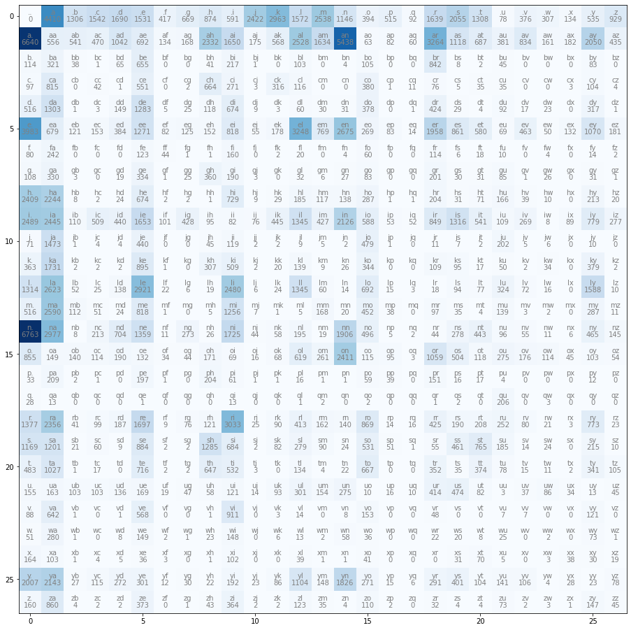
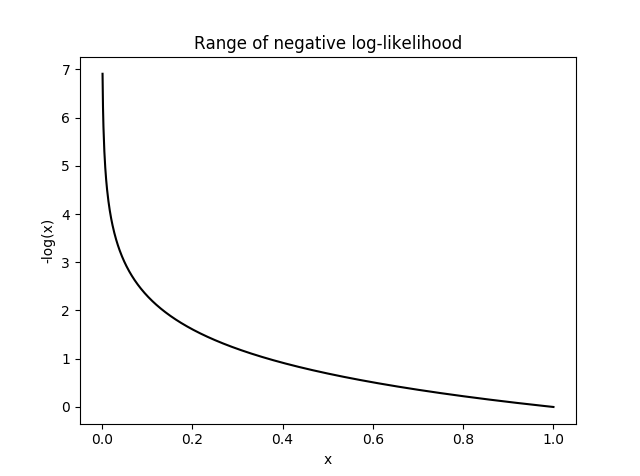
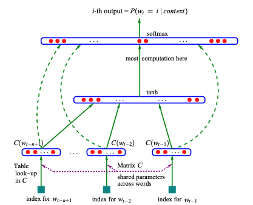
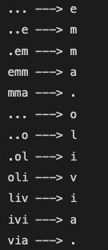

# MakeMoreEngine
In this repo, we explore an introduction to language modeling by building several language models. Please Enjoy!

### Software, Tools, and prerequisits
1. Access to Google Colab or some Jupyter Notebook.
2. Basic python programing.
3. Basic PyTorch knowledge.

### Intro: What is MakeMore Engine
As the name suggests, makemore is an engine that makes more of things given to it. For example, if trained on a list of names, MakeMore Engine would generate more unique name-like words based off what it learns from the training dataset (list of names provided). 

MakeMore is a character-level language model that treats each of its training examples as sequences of individual characters. This measn that given some characters in the sequence, it learns to predict the next character.

We would explore several autoregressive models from Bigrams to Transformers (like GPT) of this character level predictions namely:

- [Bigram Method (Explicit Counting)](https://github.com/ccibeekeoc42/MakeMoreEngine#bigram-method-explicit-counting)
- [Bigram Method (Neural Networks)](https://github.com/ccibeekeoc42/MakeMoreEngine#bigram-method-neural-networks)
- [Multi Layer Peceptron](https://github.com/ccibeekeoc42/MakeMoreEngine#multi-layer-peceptron)

### Bigram Method (Explicit Counting)
With the Bigram model, we predict the next character in the sequence using a simple lookup table containing bigram counts. We do this by looking at only two characters at a time. Given one character, we try to predict the next likely character. This is achieved by using a 2-D array where each row represents the first character and each column is the second character. This means each entry in the array is the count of how often the second character follows the first in each sequence. This is a very simple and weak language model.

First we load our dataset which in this case is a list of peoples names. Then we create a bigram lookup table using the character `.` to denote both the end and the start of each sequence (name) in our dataset.

We begin with our basic imports.

  ```python
  import torch
  import matplotlib.pyplot as plt
  %matplotlib inline
  ```

Then we proceed to create our bigram lookup table containing frequency of each character pairs.

```python
words = open('names.txt', 'r').read().splitlines()
# Creating lookup table
N = torch.zeros((27, 27), dtype=torch.int32)
chars = sorted(list(set(''.join(words))))
stoi = {s:i+1 for i,s in enumerate(chars)}
stoi['.'] = 0
itos = {i:s for s,i in stoi.items()}

for w in words:
  chs = ['.'] + list(w) + ['.']
  for ch1, ch2 in zip(chs, chs[1:]):
    ix1, ix2 = stoi[ch1], stoi[ch2]
    N[ix1, ix2] += 1
```

The table created above can then be viewed using the piece of code below.

```python
plt.figure(figsize=(16,16))
plt.imshow(N, cmap='Blues')
for i in range(27):
  for j in range(27):
    chstr = itos[i] + itos[j]
    plt.text(j, i, chstr, ha='center', va='bottom', color='gray')
    plt.text(j, i, N[i,j].item(), ha='center', va='top', color='gray')
```
<p align="center">
 
</p>

We proceed to create a probability distribution vector for each row in our lookup table (2-D array) and sample items (characters) based off the distribution density. In the code below, we are doing this to generate only 5 words.

```python
# Creating a propability distibution vectors (for each row)
P = (N+1).float() #adding 1 for fake model smoothing
P = P / P.sum(dim=1, keepdim=True)

g = torch.Generator().manual_seed(2147483647) # generator to ensure deterministic values

for i in range(5):
  out = []
  ix = 0
  while True:
    p = P[ix]
    ix = torch.multinomial(p, num_samples=1, replacement=True, generator=g).item() # Drawing 1 sample based off the distribution
    out.append(itos[ix])
    if ix == 0: # breaks if we ever get back to the . character
      break
  print(''.join(out))
```
Below are the 5 words generated. We can observe that this is a terrible sample/performance using just a plain lookup frequency table/ bigram tarining model.

```
mor.
axx.
minaymoryles.
kondlaisah.
anchshizarie.
```

Next we evaluate the performance of this probability distribution Bigram model by calculating the loss. The loss is a single number that tells us how good the model is at predicting based off the training. A good way to achieving this single loss number is know in statistics as the `Maximum Likelihood` and this is just the product of all the probabilities in our probability density table.

For simplicity and convinence, we would be working with the log-likelihood which is the sum of the log of all probabilities in the probability density table. Keep in mind that log is a monotonic transformation where $log(1) \approx 0$ and $log(0) \approx - \infty$. In this case, since probabilities only take on values from $0 - 1$, if we take the log of a probability close to 1, we get something close to 0. Conversely, as we go lower in probability closer to 0, we get more negative and closer to $-\infty$.

Since we are trying to measure the loss/ performance of our model, it is better to use the negative log-likelihood (NLL) instead as this signifies low is good and high (loss) is bad. See the image below. the NLL is just the negative of the log likelihood. The NLL can also be normalized for further simplicity.

<p align="center">
 
</p>


Below is the loss calculation code.The goal is to examine the loss and minimize it. Maximizing the log likelihood is equivalent to minimizing the NLL (our loss function) which is also equivalent to minimizing the normalized-NLL.

```python
# Calculating the loss
log_likelihood = 0
n = 0
for w in words:
  chs = ['.'] + list(w) + ['.']
  for ch1, ch2 in zip(chs, chs[1:]):
    ix1, ix2 = stoi[ch1], stoi[ch2]
    prob = P[ix1, ix2]
    logProb = torch.log(prob)
    log_likelihood += logProb
    n += 1
    #print(f'{ch1}{ch2}: {prob:.4f} {logProb:.4f}')
print(f'Log Likelihood: {log_likelihood:.4f}')
nnl = -log_likelihood
print(f'NNL: {nnl:.4f}')
print(f'Normalized NNL: {nnl/n:.4f}')
```

### Bigram Method (Neural Networks)
Given that the above explicit counting lookup approach for the bigram language model was overly simplictic, we attempt to achieve better performance (minimized loss) using Neural Networks (NN).

Our goal with NN is to find the set of parameters that minimize the NLL loss calculated in the above section. These said paramaters were stored in a lookup table format in the previous section but in this section, we would calculate/ tune the paramaters using a neural network to minimize the loss.

In this case, our NN will still be a bigram character level language model that receives a single character as input and predicts the next character in the sequence based on how it was trained. 

Stated differently, since we have the expected output, we have the loss function (NLL) and we can tune the network parameters to achieve lower loss.

First we create our training sets using the dataset imported earlier and we convert them into torch tensors. We also initialize our weights to a 27x27 2-D array to model having 27 neurons in our hidden layer (single layer with 27 neurons).

Then we go ahead and encode our inputs (each input is an integer that represents a corresponding letter. For example, `.` is `0`, `a` is `1`..., `z` is `25`) to obe-hot encoded vectors where each letter is represented by a vector where corresponding position is 1 and everything else is 0 for all 27 letters in the alphabet. See table below.

| Chars | Integer  |One Hot       | len(One Hot) |
| ------| -------- |--------------|--------------|
| .     | 1        |[1,0,0,...,0] | 27           |
| a     | 1        |[0,1,0,...,0] | 27           |
| b     | 2        |[0,0,1,...,0] | 27           |
| z     | 26       |[0,0,0,...,1] | 27           |

```python
# creating training set of bigrams
xs, ys = [], []
for w in words:
  chs = ['.'] + list(w) + ['.']
  for ch1, ch2 in zip(chs, chs[1:]):
    ix1, ix2 = stoi[ch1], stoi[ch2]
    xs.append(ix1); ys.append(ix2)
xs = torch.tensor(xs)
ys = torch.tensor(ys)
num = xs.nelement()
print(f"number of examples: {num}")

# Initializing the network weights
g = torch.Generator().manual_seed(2147483647) # ensuring a deterministic model
W = torch.randn((27, 27), generator=g, requires_grad=True)
```

Implementing a simplistic linear neural network without any bias or non-linear activation function, we do a dot product of our input with our waits as past of the feed forward pass of the network. 

it truns out that the outputs of this simplistic feed forward section can be interpretrd as the log(counts) rather than the counts we calculated earlier in this repo. To get the counts from these log(counts), we would need to exponiciate. This gives us smth we can interprete as counts (the N 2-D array we used previously). 

A quick aside, it is important to know the effect of exponenciation as it takes negative numbers and truns them to numbers ranging from 0 - 1. For positive numbers, it makes them more positive. 

Back to the feed forward, now we have something similar to counts (N) we can get our probabilities by normalizing across the rows (the P 2-D array we used previously). 

At this point, we have taken a one-hot encoded input or sets of inputs, multipliied by weights, and performed several differential operations (that can be back propagated) to get an output which is a distribution of probabilities that contains 27 items representing the likelihood of which character to come next.

Now the task is to find the optimal set of weights (W) such that the probabilities that come out of our neural network is good (minimized loss). We can achieve this by training the network and tuning the weights (gradient based optimization).

Keep in mind that our neural net is a single linear layer followed by a softmax and our loss here is the NLL. This is because this is a classification problem rather than a regression where a typical loss function is the mean-squared error.

```python
# Gradient descent
import torch.nn.functional as F
for k in range(100):
  # Forward Pass
  xenc = F.one_hot(xs, num_classes=27).float() # encoding our inputs
  logits = xenc @ W # log-counts
  # softmax
  counts = logits.exp()
  probs = counts/ counts.sum(1, keepdims=True)
  # loss calculation
  loss = -probs[torch.arange(num), ys].log().mean() + 0.01*(W**2).mean()
  print(f"loss: {loss.item()}")

  # backward pass
  W.grad = None # zero grad
  loss.backward()

  # Updating weights
  W.data += -50 * W.grad
```
It turns out that the explicit approach implemented in the PD method by counting optimizes the loss just as good as the graidient based approach done in this section with neural nets. This is because bigrams are just so simplistic that we could use either explict or gradient based approached.

Next we sample with our new P achieved through the NN model. Turns out with the generator, we get same values as did our explict counting method. Indicating both methods are identical but the NN is a bit more flexible.

```python
# Sampling from the neural nets
g = torch.Generator().manual_seed(2147483647)
for i in range(5):
  out = []
  ix = 0
  while True:
    xenc = F.one_hot(torch.tensor([ix]), num_classes=27).float()
    logits = xenc @ W # log-counts
    counts = logits.exp()
    p = counts/ counts.sum(1, keepdims=True)

    ix = torch.multinomial(p, num_samples=1, replacement=True, generator=g).item()
    out.append(itos[ix])
    if ix == 0:
      break
  print(''.join(out))
```

### Multi Layer Peceptron
The above two methods (Bigram Methods) are not very good because we only consider 1 item of context when predecting the next character. And they do not scale well if we decide to take in more characters into context. For example, taking 3 characters of context would lead to a `27 * 27 * 27` number of possibilities.

In this section, we explore an MLP approach based off the paper [**A Neural Probabilistic Language Model**](https://www.jmlr.org/papers/volume3/bengio03a/bengio03a.pdf), to predict the next character in a sequence but this time, we would keep context on three or more prior characters in the sequence (as in the network architecture below).

<p align="center">
 
</p>

First we go ahead and build our dataset using our previous dater of names imported. For this specific example, we are using a prior context of 3 meaning we would consider three characters that come before the character we would like the predict.

```python
block_size = 3
X, Y = [], []
for w in words[:5]:
  context = [0]*block_size
  for ch in w+'.':
    ix = stoi[ch]
    X.append(context)
    Y.append(ix)
    context = context[1:] + [ix]
X = torch.tensor(X)
Y = torch.tensor(Y)
```

The above pice of code looks like this 

<p align="center">
 
</p>

<p align="center">
 
</p>


### Glossary
- [**Autoregressive Model**](https://www.google.com/search?q=auto+regressive+meaning): A statistical model thaqt predicts future values based on past values.
- [**Maximum Likelihood**](https://en.wikipedia.org/wiki/Maximum_likelihood_estimation): A method of estimating the parameters of a probability distribution, given some observed data.
- [**Probability Distribution**](https://www.google.com/search?q=probability+distribution): A mathematical function that describes the probability of different possible values of a variable.